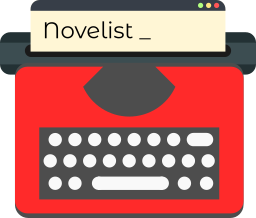

[](https://travis-ci.org/novelistapp/novelist/) [](https://forthebadge.com)

An awesome text editor for authors.

## For end-users

Sorry! There isn't much to show off yet. 
But be sure to check back thegithub
[releases](https://github.com/novelistapp/novelist/releases) soon!


## For developers

Novelist is entirely written in Rust, 
and as such uses the `cargo` build system.
Make sure you have [Rust](https://rust-lang.org)
installed on your system before proceeding.
You will need a nightly compiler version
which is newer then `2018-09-15`.

There is a lot of documentation about the internal workins
right in the code. 
You can use `cargo` to generate easily readable,
local web-pages from it.

```
$ cargo doc --document-private-items --open
```

If you want to help out with an issue, make sure to let someone know.
We might be able to help you – if you want. 
The code itself follows some very rigid structures 
so make sure to look at how other types 
and components are laid out before writing anything.

And always make sure to test your code with `cargo test` 😉

## Code of Conduct

We have a code of conduct and it's documented
[here](Code_Of_Conduct.md),
which is the Contributer Covenant. Be nice!

## License

Novelist is free software, licensed under the MIT/X11 license. This means you are allowed to do pretty much whatever with the project that you want. In any case, be sure to read the [LICENSE](LICENSE) file to make sure.

